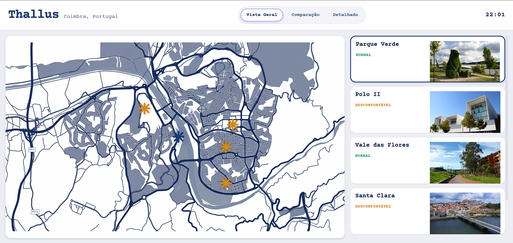
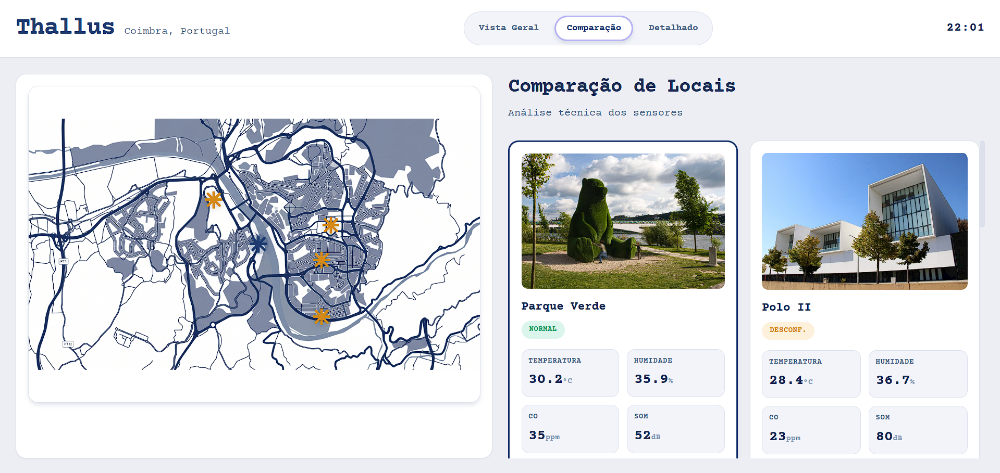
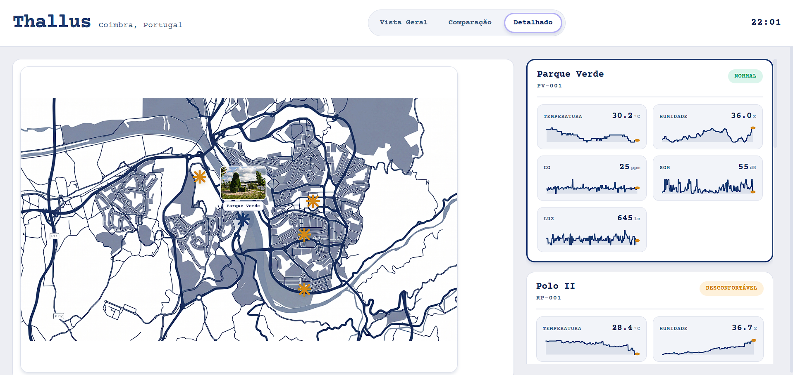
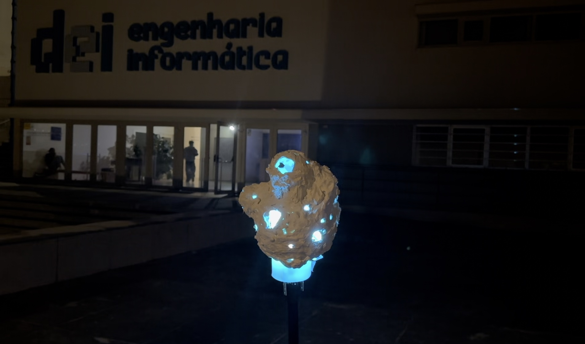
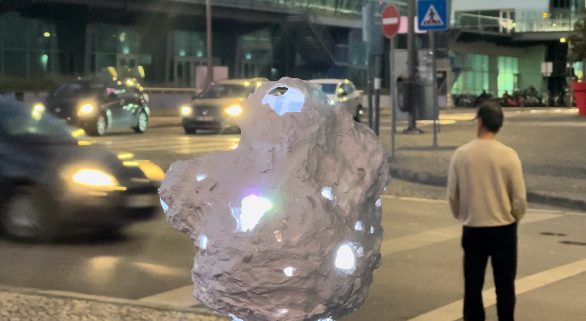
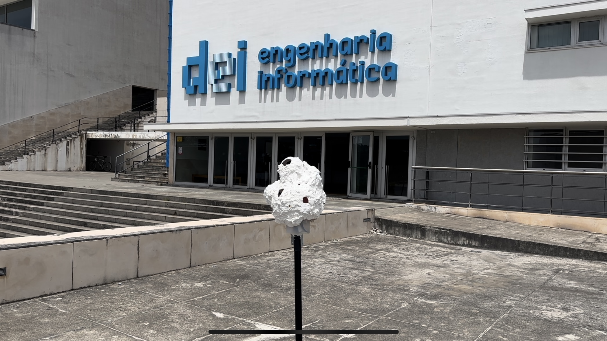
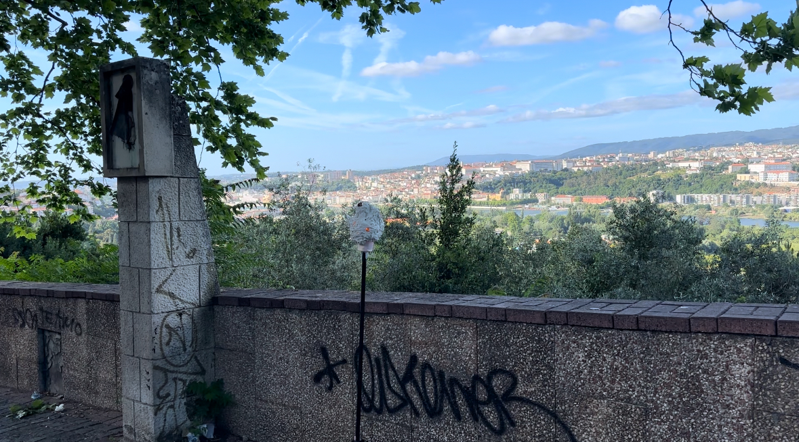

# Thallus — Interface de Monitorização Ambiental Urbana

Interface web para monitorização e visualização em tempo real de dados ambientais recolhidos em vários pontos da cidade de Coimbra. Desenvolvida no âmbito da unidade curricular de Tecnologias de Interface do Mestrado de Design e Multimédia da Universidade de Coimbra, sob orientação dos docentes Tiago Cruz e Sérgio Rebelo.

---

## Interface

### Vista Geral


### Comparação


### Detalhado


---

## Objeto Físico



---

## Descrição

Thallus surge como resposta a um problema de invisibilidade da maior parte dos dados ambientais urbanos. Qualidade do ar, ruído, luminosidade, humidade e temperatura mudam constantemente e afetam o nosso quotidiano, mas não têm presença percetível no espaço.

O projeto materializa esses dados em duas formas complementares. A **interface web** agrega leituras de múltiplos pontos da cidade de Coimbra e apresenta-as de forma visual e interativa sobre um mapa, com três modos de visualização e suporte a dados em tempo real via MQTT. O **objeto físico** que traduz o mesmo ambiente em luz, a cor muda com a temperatura, a pulsação acompanha o nível de ruído, os LEDs apagam-se progressivamente com a poluição, e a saturação reflete a humidade — um mapeamento intuitivo e imediato das condições locais.

O projeto é inspirado nas algas coralinas, organismos bioindicadores que revelam o estado do ambiente em volta através da sua própria aparência. O Thallus parte dessa ideia, um objeto que, à semelhança de um ser vivo, muda de estado em resposta ao ambiente que o rodeia.

---

## Funcionalidades

- **Três modos de visualização:** Vista Geral, Comparação e Detalhado
- **Mapa** com pinos por localização
- **Dados em tempo real** via MQTT com fallback automático para ficheiros históricos
- **Gráficos sparkline** por sensor em modo detalhado, com histórico até 120 leituras
- **Playback automático** dos dados históricos a cada 5 segundos
- **Interface responsiva** adaptada a alguns tamanhos de ecrã

---

## Localizações Monitorizadas

| ID | Nome | 
|---|---|
| loc_1 | Parque Verde | 
| loc_2 | Polo II | 
| loc_3 | Vale das Flores | 
| loc_4 | Santa Clara | 
| loc_5 | Estádio | 

---

 
 

---

## Hardware — Microcontrolador (ESP32)

O microcontrolador **ESP32** com Arduino IDE. Recolhe dados ambientais de quatro sensores, publica-os via MQTT a cada 5 segundos e controla uma fita de LEDs que traduz o ambiente em luz.

### Componentes

| Sensor | Modelo | Pino(s) | Mede |
|---|---|---|---|
| Temperatura e Humidade | DHT22 | GPIO 25 | °C e % HR |
| Luminosidade | LDR | GPIO 34 (ADC) | luz ambiente (0–4095) |
| Qualidade do Ar | MQ-9 | GPIO 35 (ADC) | CO/gases (0–4095) |
| Microfone | INMP441 | GPIO 26/33/32 (I2S) | nível de ruído (0–1) |
| Fita LED | NeoPixel | GPIO 13 | saída visual (30 LEDs) |

### Visualização LED

A fita de 30 LEDs traduz o ambiente em tempo real:

| Parâmetro ambiental | Efeito visual |
|---|---|
| **Temperatura** | Cor base — azul (frio) → ciano → amarelo → laranja → vermelho (calor) |
| **Qualidade do ar** | LEDs "mortos" — quanto maior a poluição, mais LEDs apagados aleatoriamente |
| **Ruído** | Pulsação — velocidade e amplitude crescem com o nível sonoro |
| **Humidade** | Saturação da cor — ar mais húmido = cores mais deslavadas |
| **Luminosidade** | Sensibilidade global — luz intensa amplifica os efeitos dos outros sensores |

 
 

### Payload publicado (a cada 5 segundos)

```json
{
  "locations": [
    {
      "id": "L17312123412",
      "name": "Santa Clara",
      "sensors": {
        "temperature": 18.5,
        "humidity": 62.0,
        "airQuality": 1240,
        "noise": 0.42,
        "light": 1800
      }
    }
  ]
}
```

### Bibliotecas Arduino

| Biblioteca | Uso |
|---|---|
| `WiFi.h` | Ligação à rede Wi-Fi |
| `PubSubClient` | Cliente MQTT |
| `ArduinoJson` | Serialização do payload JSON |
| `DHT` | Leitura do sensor DHT22 |
| `Adafruit_NeoPixel` | Controlo da fita LED |
| `ESP_I2S` | Leitura do microfone INMP441 via I2S |

---

## Sensores e Classificação

Cada localização expõe cinco métricas convertidas a partir dos valores brutos dos sensores:

| Sensor | Unidade | Conversão |
|---|---|---|
| Temperatura | °C | valor direto |
| Humidade | % | valor direto |
| Qualidade do Ar (CO) | ppm | `airQuality / 4095 × 500` |
| Ruído | dB | `35 + noise × 45` |
| Luminosidade | lx | `light / 4095 × 5000` |

A classificação de estado é calculada por limiares configuráveis em `data-manager.js`:

- **Normal** — todos os valores dentro dos limites
- **Desconfortável** — pelo menos um valor acima/abaixo dos limiares de desconforto
- **Perigoso** — pelo menos um valor acima/abaixo dos limiares de perigo

---

## Arquitetura

```
Thallus/
├── index.html               # Estrutura HTML
├── app.js                   # Ponto de entrada
├── data-manager.js          # Carregamento, conversão e classificação de dados
├── mqtt-client.js           # Ligação MQTT e normalização das leituras
├── playback-manager.js      # Playback sequencial dos dados históricos
├── ui-controller.js         # Renderização e interação da interface
├── server.js                # Servidor estático Node.js
├── css/
│   ├── main.css             # Estilos gerais
│   ├── overview.css         # Vista geral
│   ├── comparison.css       # Vista de comparação
│   ├── detailed.css         # Vista detalhada e gráficos
│   └── responsive.css       # Breakpoints (1200px, 768px, 480px)
├── data/
│   ├── locations.json       # Configuração das localizações
│   └── *.webp / *.jpg       # Imagens das localizações
├── collected-data/
│   └── <localização>.json   # Dados históricos por localização
└── TIsketch2/
    └── TIsketch2.ino        # Firmware do nó sensor (ESP32)
```

---

## Fluxo de Dados

```
ESP32 (nó sensor)
        │
        │  MQTT TCP :1883  tópico: coimbra/sensores
        ▼
Broker MQTT (broker.emqx.io)
        │
        │  WebSocket wss://:8084
        ▼
  mqtt-client.js
  normalizeReadings()     ← suporta 3 formatos de leituras
        │
        ▼
  data-manager.js
  applyLiveReading()      ← marca localização como "live"
  convertSensors()        ← converte valores brutos para unidades reais
        │
        ▼
  ui-controller.js
  render()                ← atualiza o modo de visualização ativo

  (sem ligação MQTT)
        │
  playback-manager.js
  advance()               ← percorre leituras históricas a cada 5s
        │
        ▼
  data-manager.js
  collected-data/*.json   ← dados históricos carregados no arranque
```

Quando a ligação MQTT está ativa, as localizações com dados ao vivo ficam marcadas com `isLive = true` e o playback histórico é ignorado para essas localizações. Ao desligar, o estado é reposto e o playback retoma automaticamente.

---

## Normalização das leituras MQTT

O cliente MQTT aceita três formatos de leituras distintos e normaliza-as para um array uniforme `[{ name, sensors, ... }]`:

**Formato 1** — array de localizações (usado pelo ESP32):
```json
{ "locations": [ { "name": "Santa Clara", "sensors": { ... } } ] }
```

**Formato 2** — objeto com chaves por nome:
```json
{ "locations": { "Santa Clara": { "sensors": { ... } } } }
```

**Formato 3** — leitura única:
```json
{ "name": "Santa Clara", "sensors": { ... } }
```

---

## Instalação e Execução

```bash
# Instalar dependências
npm install

# Iniciar o servidor
npm start
```

A interface fica disponível em `http://localhost:3000`.

Para o nó sensor, abrir `TIsketch2/TIsketch2.ino` no Arduino IDE, configurar as credenciais Wi-Fi e fazer upload para o ESP32.

---

## Dados Históricos

Os ficheiros históricos devem estar em `collected-data/` com o nome derivado do campo `name` da localização (espaços e caracteres especiais substituídos por `_`, em minúsculas). Exemplo: `parque_verde.json`.

Formato esperado:
```json
{
  "readings": [
    {
      "timestamp": "2024-01-15T10:30:00.000Z",
      "sensors": {
        "temperature": 18.5,
        "humidity": 62.0,
        "airQuality": 120,
        "noise": 0.42,
        "light": 1800
      }
    }
  ]
}
```

---

## Tecnologias

| Componente | Tecnologia |
|---|---|
| Servidor | Node.js + Express |
| Interface | HTML5 + CSS3 + JavaScript |
| Comunicação MQTT (browser) | MQTT.js (WebSocket) |
| Comunicação MQTT (sensor) | PubSubClient (Arduino) |
| Broker | broker.emqx.io |
| Gráficos | SVG gerado dinamicamente |
| Estilos | CSS Grid, Flexbox, Custom Properties |
| Microcontrolador | ESP32 (Arduino IDE / C++) |
